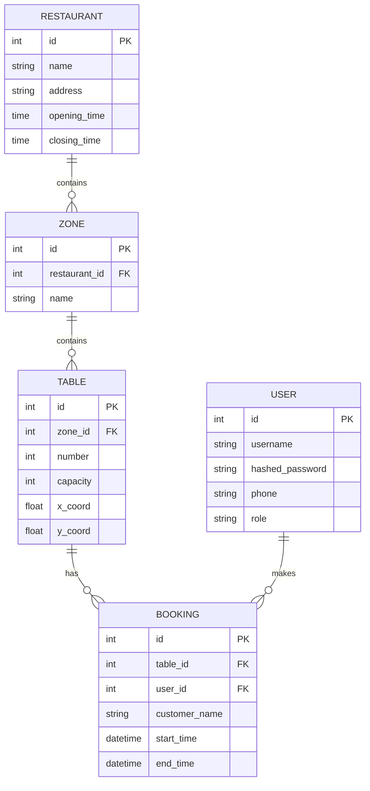
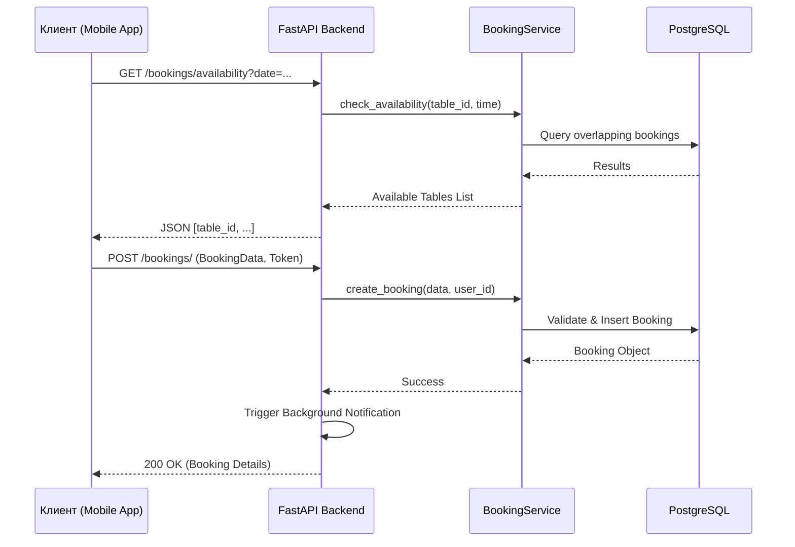

# 🍽️ Система бронирования столиков в ресторанах (Вариант 31)

Это курсовой проект по дисциплине «Методы и технологии программирования». Система представляет собой бэкенд для мобильного приложения бронирования столиков в ресторанах (предметная область HoReCa).

## 🚀 Быстрый запуск

Проект настроен для запуска с помощью Docker.

**Предпосылки:** Установленный [Docker Desktop](https://www.docker.com/products/docker-desktop/).

1. Склонируйте этот репозиторий.
2. Откройте терминал в корне проекта.
3. Запустите команду:
   ```bash
   docker-compose up -d
   ```
4. **Готово!** Бэкенд доступен по адресу: [http://localhost:8000/](http://localhost:8000/)

---

## 🛠 Функциональные возможности

- **Управление доступностью:** Автоматическая проверка пересечения интервалов бронирования.
- **Карта залов:** Предоставление координат (`x_coord`, `y_coord`) для визуализации столов на фронтенде.
- **Зонирование:** Поддержка разделения ресторана на зоны (например: "Основной зал", "Терраса", "VIP").
- **Контроль времени:** Валидация бронирований в соответствии с часами работы ресторана.
- **Уведомления:** Система подтверждения бронирования (симуляция отправки уведомлений).
- **Ролевая модель:** Разделение прав доступа между Администратором и Клиентом.

## 📐 Технический стек и архитектура

- **Backend:** Python 3.11, FastAPI (асинхронный фреймворк).
- **Database:** PostgreSQL 15, SQLAlchemy 2.0 (ORM).
- **Validation:** Pydantic V2 (валидация данных).
- **Infrastructure:** Docker, Docker Compose.
- **Testing:** Pytest, HTTPX.

### Архитектурная схема (ER-диаграмма)



### Процесс бронирования (Sequence Diagram)



## 📖 Документация API

Все эндпоинты задокументированы автоматически с помощью Swagger UI.
После запуска проекта перейдите по ссылке:
👉 [http://localhost:8000/docs](http://localhost:8000/docs)

## 🧪 Тестирование и Качество

### Автоматические тесты
Реализованы интеграционные тесты, покрывающие основные бизнес-процессы (аутентификация, доступность, создание и управление бронированиями).

**Запуск тестов в Docker:**
```bash
docker exec booking_web sh -c "PYTHONPATH=. pytest tests/test_api.py"
```

### Ручное тестирование (Seed Data)
Для быстрого наполнения базы данных тестовыми данными (рестораны, столы, пользователи и случайные бронирования) предусмотрен скрипт `seed_db.py`.

**Запуск наполнения БД:**
```bash
docker exec booking_web python seed_db.py
```
*Внимание: скрипт полностью очищает текущие данные перед заполнением.*

## 📂 Структура проекта
- `app/` — основной код приложения.
  - `api/` — эндпоинты (маршруты).
  - `core/` — настройки, безопасность, конфиги.
  - `db/` — сессии и подключение к БД.
  - `models/` — SQLAlchemy модели.
  - `schemas/` — Pydantic схемы.
  - `services/` — бизнес-логика.
  - `static/`, `templates/` — ресурсы для веб-интерфейса.
- `tests/` — интеграционные тесты.
- `docker-compose.yml` — конфигурация инфраструктуры.
- `seed_db.py` — скрипт для наполнения БД тестовыми данными.
